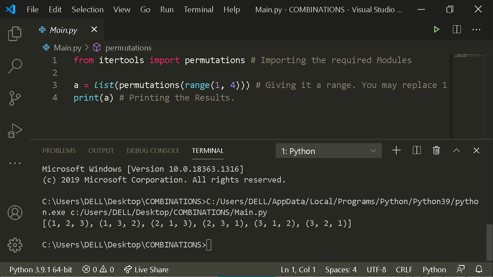

# Possible_Combinations_Teller
This Project provides us with all the possible combinations present in a set of Numbers. It uses itertools module which comes preinstalled with Python if you did the installation correctly. Below is my Code Screenshot:

Hope that you like it.
